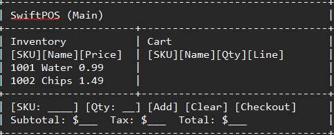

# SwiftPOS — Week 1 Proposal

## Project Pitch (what it is)
SwiftPOS is a Point of Sale app for small shops. It loads inventory from a CSV file, lets a user add items to a cart, calculates tax, and prints a text receipt.

## GUI Mockup


## CRC (quick)
- **Main**: handles flow, user input, cart, totals, writes receipt  
  *Uses:* Product  
- **Product**: sku, name, price, stock, category

## UML (mermaid)
```mermaid
classDiagram
  class Main {
    +loadInventory()
    +listProducts()
    +addToCart()
    +showCart()
    +checkout()
    +writeReceipt()
  }
  class Product {
    +sku:String
    +name:String
    +price:double
    +stock:int
    +category:String
  }
  Main --> Product

##Planned Working Time

Most of my time to work on this project is very late at night after work/school. I basically do this when everything else is done and it’s quiet.

Outside of class, I can realistically work in these blocks:
Monday night ~11:30pm to ~1:00am
Wednesday night ~12:00am to ~2:00a
Saturday night ~11:00pm to ~1:00am
This is around 5–6 hours per week outside of class.
During normal daytime I’m not really available, so I have to build the project in small focused sessions at night. I will also try to use about 1 hour each week during class time to code and test.
If I start falling behind, I’ll add an extra 1:00am–2:00am session on Sunday night.

Learning Outcomes (LO1–LO8)

LO1 – Object-oriented design
I planned the classes first (CRC, UML) and I’m giving each class a clear job. I’m treating this like MVC: data/model first, then controller, then the screen.

LO2 – Arrays / collections
The program will keep products and cart items in collections (ArrayList / similar). I will also load product info from a CSV file into memory.

LO3 – Classes and “has-a” relationships
The logic is built using objects, not just raw numbers. For example: the cart “has” items, and an item “has” a product with price, stock, etc.

LO4 – Inheritance / polymorphism
Later I plan to add an interface or different product types (for example different receipt formatters). That will let me show polymorphism.

LO5 – Generic collections / data structures
I will use Java collections (lists / maybe maps) to store products and look them up by SKU, and to store the current cart.

LO6 – GUI and event-driven programming
The POS will have buttons like “Add”, “Remove”, “Checkout”. When you click a button, it calls code. So the program reacts to user events, not just manual console input.

LO7 – Exception handling
Bad input (like negative price, quantity 0, or trying to checkout an empty cart) should not crash the whole program. I will throw an exception in the logic layer and catch it, then show a simple error message.

LO8 – File I/O
After checkout, the program will write a text receipt (subtotal, tax, total, items) to a .txt file so there is a saved record.

Timeline / TODO Plan (Weeks 1–8)

Week 1:

Write project pitch and rough GUI mockup
Write CRC cards
Make first UML for the main classes
Plan my work schedule (late-night time blocks)

Week 2:

Start coding the model: product loading, cart logic, totals math
Add basic exception checks (for example: quantity must be > 0)
Do first tests in console to make sure it works
Update UML if I had to change anything

Week 3:

Add a controller layer (connect user actions to the cart logic)
Add receipt creation (make a string with subtotal, tax, total, etc.)
Improve error handling so it warns instead of just dying

Week 4:

Build the first basic POS-style screen (GUI) with buttons for Add + Remove + Checkout
Hook those buttons into the controller methods
Make totals update live when items change
Clean up and record a short demo video

Week 5:

Make the GUI look  easier to understand
Show clear messages if something is invalid
Start saving the final receipt to a .txt file

Week 6:

Add any interface work I still need for LO4 (for example different product types or formatter styles)
Refactor code so the “model” and the “UI” are more separate and clean

Week 7:

Debug and fix any remaining issues
Check that I actually covered all the Learning Outcomes in code

Week 8:

Record final wrap up video explaining how each Learning Outcome shows up in my project
Turn in final code and docs
